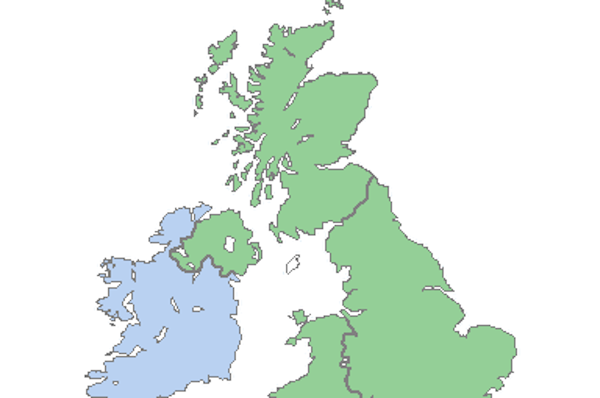
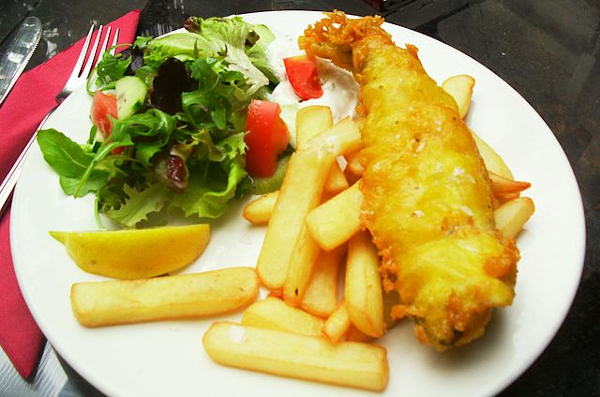

<h1>Welcome</h1>

Write your content in here as you would normally in HTML

three things i like

<ul>
<li>dogs</li>
<li>cats</li>
<li>birds</li>
</ul>

  

    

      
        

          
Some information about the first image

        

     

  

  

    

      
        

          
Some information about this image

        

     

  

  

    

      
        

          
Some information about the final image

        

    

  

