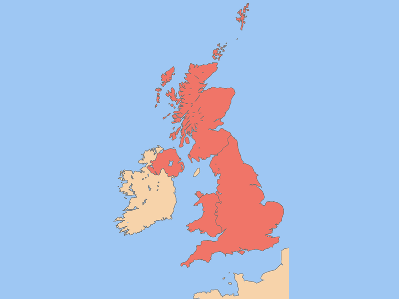

<h1>Welcome</h1>

Write your content in here as you would normally in HTML

three things i like

<ul>
<li>dogs</li>
<li>cats</li>
<li>birds</li>
</ul>

   

      <h3></h3>
      
      
Figure 1: Map of UK

      

    

      <h3>About the UK</h3>
      
United Kingdom, island country located off the northwestern coast of mainland Europe. The United Kingdom comprises the whole of the island of Great Britain—which contains England, Wales, and Scotland—as well as the northern portion of the island of Ireland. The name Britain is sometimes used to refer to the United Kingdom as a whole. The capital is London, which is among the world’s leading commercial, financial, and cultural centres. Other major cities include Birmingham, Liverpool, and Manchester in England, Belfast and Londonderry in Northern Ireland, Edinburgh and Glasgow in Scotland, and Swansea and Cardiff in Wales.

      
Another paragraph.

  

